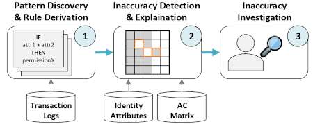
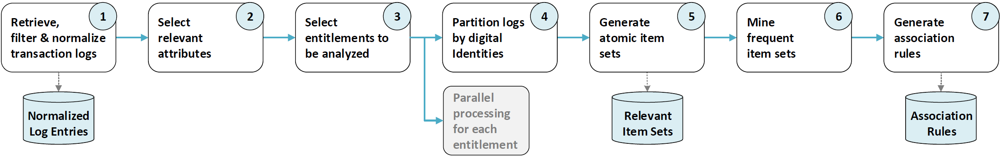

# Transaction Log Research Demo

This project contains a simplified demo implementation of the data processing and analysis pipeline used during the
analysis of a large industrial IAM data set. It runs without external application dependencies. The implementation is provided in Java. A
synthetic sample transaction log data set is provided as csv file.

## 1. Quick Setup

Clone this repository:
   
    git clone https://github.com/transactionlogsresearch/researchdemo
   

Install libraries via maven. This project includes two libraries: A library for the Apriori implementation and a CSV reader library (see pom.xml for details). 
   
    mvn install

Once installed, you can run the project with a provided sample data set. The entry class with the main method is:

    org.anonymous.transactionlogs.TransactionLogsMain

A synthetic test data set is provided in:

    src/main/resources/sample_events.csv

The TransactionLogsMain class is prepared to run it without further parameterization. A second, tiny data set is provided via sample_events_tiny.csv. If you include it in the main class, you should be able to follow step by step how transaction log entries are processed to generate association rules.

## 2. General Approach

Association rule learning is a standardized data mining method. Association rules help understanding large data sets by highlighting correlations that might lead to new insights. For the case study with enterprise data, the association rules were generated and evaluated in three steps:

1. The transaction logs retrieved from the enterprise infrastructure were used to generate association rules. Details about the generation are given in the next section.
2. The generated association rules were used to analyze the current IAM data state. For the case study, only rules with an implication structure {ADD_ENTITLEMENT} -> {ADD_ATTRIBUTE}. The generated rules were compared with the actual attributes and authorizations of digital identities. If a digital identity had roles or permissions covered by the left-hand side of a rule, but violated the attribute condition in its right-hand side, a possible inaccuracy was assumed.
3. We presented the rules and identified error candidates to IAM experts at the company studied. In a joint examination, we validated the correctness of the rules and the plausibility of the identified inaccuracies. As a result, we found strong association rules for 20 roles and identified 1,157 candidates for excessive authorizations. We handed over our generated rules and identified inaccurate ACPs so the studied company could refine their ACPs and fix inaccurate authorizations.

Please note that we were not allowed to extract any real data from the partnering enterprise. However, this repository provides a sample data set and an implementation that allow comprehend the approach.

## 3. Implementation Details

The generation of association rules from transaction logs is done in seven steps:

1. First, the pipeline retrieves, filters, and normalizes all transaction logs from an IAM infrastructure for a given period. The resulting normalized log entries contain two types of data changes for a digital identity: ADD_ATTRIBUTE and ADD_ENTITLEMENT. We also could have extracted REMOVE_ATTRIBUTE and REMOVE_ENTITLEMENT, but excluded them to simplify the analysis.
2. Afterward, the log entries are filtered for relevant attributes. For example, an employee’s department affiliation is likely relevant for their authorizations, while their email address is not.
2. A set of entitlements to be analyzed serves as input. This step splits the processing pipeline into sub-processes, one for each analyzed entitlement. All log entries regarding other entitlements are filtered out of the sub-processes. Every set of association rules will be generated for exactly one entitlement.
3. The log entries are partitioned by the affected digital identities.
5. The sliding window technique processes each transaction log partition and generates item sets of transaction logs in temporal proximity.
6. All item sets are processed to generate frequent item sets.
7. The frequent item sets are evaluated by the Apriori algorithm to create association rules for the analyzed entitlements.

Chosen parameters:
- Analyzed transaction log time span: 20.03.24 - 20.09.24 (six months)
- Sliding window length: 30 days
- Minimum Support: 0.6
- Minimum Confidence: 0.6

Analyzed attributes:
- Department,
- Job Title,
- Employee Type,
- Country,
- Location,
- Company,
- External Company,
- Cost Center, 
- Is Manager

## 4. Future Work

While the resources of this research work were limited, we emphasize that transaction logs might enable many more analytical use cases. For example:

- While we compared association rules with the current IAM data state, they could also be used to check other Mover process instances for unusual authorization changes.
- Association rules can be used to explain why a digital identity received certain authorizations
- Association rules can be used to identify posibble attribute errors
- Association rules could serve as a foundation to generate automation rules or descriptions for permissions
- Clustering or classification techniques might provide further insights or identify possible errors
- Transaction logs allow restoring previous data states, allowing existing visualizations and tools to implement data browsing capabilities
